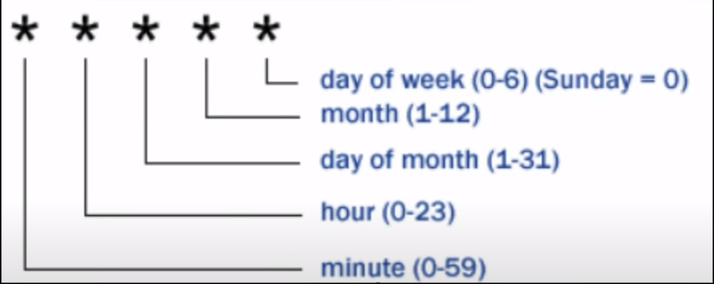

# Introduction

## What is Linux Shell?

A shell provide an environment to a user to execute commands and interact with kernel. 

**There are different types of shell**
-  Bash
-  sh
-  ksh
-  tsh
-  fish
-  zsh

## What is my shell type?

You can check using 
```bash
echo $0
```
## What is shell scripting?

-  Shell script consist of set of commands to perform a task.
-  All the commands execute sequentially.
-  Some task like file manipulation, program execution, user interaction, automation of task etc can be done.

# Basic Scripting

## First basic script

```bash
#!/bin/bash

echo "Arch Linux!!!"
```

### What is shebang?

-   #!/bin/bash
-  The #! character sequence at the beginning of a script in Unix-like operating systems.
-   The shebang is followed by the interpreter or the command that should be used to execute the script.

### Sending output to terminal

echo "Arch Linux!!!"

## How to run a Script

-  Make sure script has execute permission rwx.
-  Run using 
	+ ./script.sh
	+ /path/script.sh
	+ bash script.sh
-  Ctrl + c to terminate
-  Ctrl + z to stop

## Comments

+  Using #
```bash
#This is a comment
```

+  Multi-line comment
```bash
<<comment
your comment here
comment
```

## What are variables?

```bash
var_name=value
var_name=$(hostname)
echo $var_name
```

## Constant variable?

Once you defined a variable and don't wanna change it until end of the script.

```bash
readonly var_name="BlackArch"
```

# Array

-  How to define an array?
```bash
myArray=( 1 2 hello "sample text")
```

+  How to get values from an array?
```bash
echo "${myArray[*]}" #every element of array
echo "${myArray[1]}" #second element of array
```

+  How to get length of array?
```bash
echo "${#myArray[*]}"
```

+  How to get specific values?
```bash
echo "${myArray[*]:1}" #list all element from 1 index
echo "${myArray[*]:1:2}" #list 2 element form 1 index
```

+  How to update an array?
```bash
myArray+=( 5 6 8 )
```

## Arrays key-value

```bash
declare -A myArray
myArray=( [key1]=value1 [key2]=value2 )

echo "${myArray[key1]}"
```

# String Operations

+  Defining string in variable
```bash
myVar="Arch is the best linux"
```

+  Length of the string.
```bash
length=${#myVar}
```

+  Upper case
```bash
upper=${myVar^^}
```

+  Lower case
```bash
lower=${myVar,,}
```

+  replace the word
```bash
replace=${myVar/Arch/BlackArch}
```

+  Slice in string
```bash
slice=${myVar:6:11}
```

# User Interaction
## Taking input from User...

+  user input
```bash
read var_name
```

+  print statement before user input
```bash
read -p "Statement to print" var_name
```

# Arithmetic Operations

+  Using let command, let user define the arithmetic operation.
```bash
let a++
let a=5*10
```

+  without using let command, by "((  ))"
```bash
((a++))
((a=5*10))

example
echo "sum = $(($x+$y))"
```

# Conditional Statement
## if-else

+  **Syntax**
```bash
if [ expression ]
then
   Statement(s) to be executed if expression is true
else
   Statement(s) to be executed if expression is not true
fi
```

+ **Example**
```bash
if [ $marks -gt 40 ]
then
	echo "you are pass"
else
	echo "you are fail"
fi

**NOTE:** in place of "[condition ]" you can user " [[condition]]"
```

## Operators

| meaning                  | operator |
| ------------------------ | -------- |
| equal                    | -eq / == |
| greater than or equal to | -ge      |
| less than or equal to    | -le      |
| not equal                | -ne / != |
| greater than             | -gt      |
| less than                | -lt      |

## elif

+  **Syntax**
```bash
if [ expression 1 ]
then
   Statement(s) to be executed if expression 1 is true
elif [ expression 2 ]
then
   Statement(s) to be executed if expression 2 is true
elif [ expression 3 ]
then
   Statement(s) to be executed if expression 3 is true
else
   Statement(s) to be executed if no expression is true
fi
```

+  **Example**
```bash
if [[ $marks -ge 80 ]]
then
	echo "first division"
elif [[ $marks -ge 60 ]]
then 
	echo "second division"
else 
	echo "fail"
fi
```

## case

+  **Syntax**
```bash
case EXPRESSION in
  Pattern_Case_1)
   STATEMENTS
   ;;
 Pattern_Case_1)
   STATEMENTS
   ;;
 Pattern_Case_N)
   STATEMENTS
   ;;
 *)
   STATEMENTS
   ;;
esac
```

+  **Example**
```bash
echo "hey choose an option"
echo "a = to see the current date"
echo "b = list all the files in current dir"

read choice

case $choice in
	a) date;;
	b) ls;;
	*) echo "not a valid input"
esac
```

# Logical Operators &&, ||, !

+  condition1 && condition2
If both conditions are true then true else false.

+  condition1 || condition2
If any of the condition is true then true.

+  condition1 && condition2 || condition3
Execute condition2 only when 1 is true else execute condition3.
```bash
[[ $age -ge 18 ]] && echo "adult" || echo "minor"
```

# Loops
## For loop

+  **Syntax**
```bash
for <var> in <value1 value2 ... valuen>  
do  
    <command 1>  
    <command 2>  
    <etc>  
done
```

+  **Example**
```bash
for i in 1 2 3 4 5
do 
	echo "number is $i"
done
```

+  for loop with array
```bash
myArray=( 1 2 3 hello hi )
length=${#myArray[*]}

for (( i=0;i<$length;i++ ))
do
	echo "value of array is ${myArray[$i]}"
done
```

+  Other ways to write for loop
```bash
for j in raju sham baburao

for p in {1..20}
```

## Iterate values from file..

```bash
items="/home/xander/file.txt"

for item in $(cat $items)
do 
	echo $item
done
```

## While loop

+  It will *terminate once that condition returns false.*

+  **Syntax**
```bash
while <condition>  
do  
    <command 1>  
    <command 2>  
    <etc>  
done
```

+  **Example**
```bash
count=0
num=10

while [[ $count -le $num ]]
do 
	echo "number are $count"
	let count++
done
```

## Until loop

+ It will *terminate when the condition return true.*

+  **Syntax**
```bash
until [ condition ];
do
 block-of-statements
done
```

+ **Example**
```bash
a=10
until [[ $a -e 1 ]]
do 
	echo $a
	a=`expr $a - 1`
done
```

## Infinite loop

+  while
```bash
while true
do 
	echo "hi"
	sleep 2s
done
```

+  for
```bash
for (( ;; ))
do 
	echo "hi"
	sleep 2s
done
```

# While loop - read content of file

+  **To read content form a file**
```bash
while read myVar
do 
	echo $myVar
done < file_name
```

+  **To read content from a csv file**
```bash
while IFS="," read f1 f2 f3
do
	echo $f1
	echo $f2
	echo $f3
done < file_name.csv
```

> **NOTE:** to void heading of csv file use this

```bash
cat myfile.csv | awk '!NR=1 {print}' | while IFS="," read f1 f2 f3
do
	echo $f1
	echo $f2
	echo $f3
done < file_name.csv
```

# Functions
## What are functions
+ Block of code which perform some task and run when it is called.
+ Can be reuse many times in our program which lessen our lines of code.
+ We can pass arguments to the method.

## How to make functions?

```bash
function myfun {
	echo "hi"
}

or 

myfun() {
	echo "hello"
}
```

+  To call the function
```bash
myfun
```

## How to use arguments in functions?

```bash
addition() {
	local num1=$1
	local num2=$2
	let sum=$num1+$num2
	echo "sum $sum"
}

---------------------------
# calling function

addition 24 67
```

# Arguments Passing

## Arguments in script..

```bash
myscript.sh arg1 arg2..
```

+  How to access these arguments inside our script?

| meaning                      | variable |
| ---------------------------- | -------- | 
| to get number of arguments   | $#       |
| to display all arguments     | $@       |
| to use or display a argument | $1 $2 .. |
## Using arguments in for loop

```bash
for arg in $@
do 
	echo "argument is $arg"
done
```

## Shifting Arguments

+ When we pass multiple arguments, we can shift
+ for Example.
```text
A B C
shift
B C
```

- before shifting the argument are A B C , after shifting the argument are B C.

# Other Useful Concepts

+ **break** : To stop the loop

+ **continue** : To stop current iteration of loop and start next iteration.

+ **sleep** : to create delay between two executions ex: sleep 1s/1m.

+ **exit** : to stop script at a point.

+ exit status **$?** : gives you status of previous command if that was successful.

+ **basename** : strip directory info and only give filename.
```bash
basename /home/user/myscripts/test.csv

# output
test.csv
```

+ **dirname** : strip the filename and gives directory path.
```bash
basename /home/user/myscripts/test.csv

# output
/home/user/myscripts
```

+ **realpath** : gives you full path for a file.
```bash
realpath test.csv

# output
/home/user/myscripts/test.csv
```

+ **RANDOM** : A random integer between 0 and 32767 is generated.
> echo $RANDOM

+ **UID** : User ID of the user logged in. *For root user uid value is **0**.*
> echo $UID

## Check if file/dir exit

```bash
if [ -d folder_name ] #if folder exits
if [! -d folder_name ] #if folder not exits

if [ -f file_name ] #if file exits
if [ ! -f file_name ] #if file not exits.
```

## Redirection in scripts

+  redirect the output to the file ( > )
```bash
ls > text.txt
```

+  Append to the file ( >> )
```bash
pwd >> text.txt
```

# What is /dev/null

In case if you don't wanna print the output of a command on terminal or write in a file.

we can redirect the output to **/dev/null**

**Example:**
```bash
cd /root &> /dev/null
```

## Print name of the script

```bash
echo "The name of the script is: ${0}"
```

# Log messages..

If you want to maintain the logging for your script, you can use **logger** in your script.

You can find the logs under
**/var/logs/messages**

Example: 
```bash
logger "hey buddy"
```

# Debugging Scripts

+  If we can enable the debugging of the script using below in the script.
```bash
set -x
```

+  If we want to exit our script when a command fail.
```bash
set -e
```

# Running Script in Background

+  By using **nohup** command we can run script in background.
```bash
nohup ./script.sh &
```

+  The output will be saved in **nohup.out** file
```bash
cat nohup.out
```

# Automate our Script
## Using at command

+  For scheduling only one time, use **at**
```bash
at 12:09 PM
	<your_command>
ctrl + D
```

+  **atq**  to check scheduled job.
+ **atrm id**  to remove the schedule.

+  The output will be saved in **filename.log** file.

+  For scheduling on particular day.
```bash
at 23:00 31 March 2024
	<your_command>
ctrl + D
```

## Using crontab command

+  crontab is used for automate the script on daily bases.

+ to check the existing jobs - `crontab -l`
+ to add new job  -  `crontab -e`

```bash
* * * * * <command> && ./script_name.sh
```



